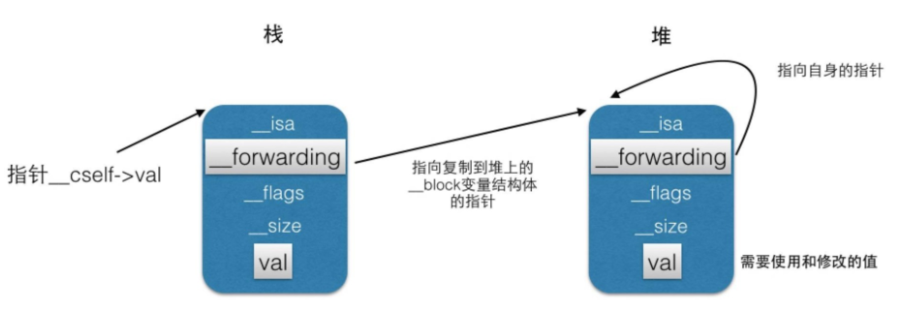

# Block

### Block 本质

```
struct Block_layout {
    void *isa;
    volatile int flags; // contains ref count
    int reserved; 
    void (*invoke)(void *, ...);
    struct Block_descriptor_1 *descriptor;
    // imported variables
};

struct Block_descriptor_1 {
    unsigned long int reserved;
    unsigned long int size;
};
```

从OC源码中看到，block的结构体中有个 isa 指针，block也是当作对象来处理的，常见的有3种类型：_NSConcreteStackBlock，_NSConcreteMallocBlock，_NSConcreteGlobalBlock

* _NSConcreteStackBlock
    只用到外部局部变量、成员属性变量，且没有强指针引用的block都是StackBlock。
StackBlock的生命周期由系统控制的，一旦返回之后，就被系统销毁了。

* _NSConcreteMallocBlock

    有强指针引用或copy修饰的成员属性引用的block会被复制一份到堆中成为MallocBlock，没有强指针引用即销毁，生命周期由程序员控制

* _NSConcreteGlobalBlock

    没有用到外界变量或只用到全局变量、静态变量的block为_NSConcreteGlobalBlock，生命周期从创建到应用程序结束。


### __block 关键字

使用 __block 关键字修饰的变量，会用以下结构体来代表这个变量：

```
struct Block_byref {
    void *isa;
    struct Block_byref *forwarding;
    volatile int flags; // contains ref count
    unsigned int size;
    void (*byref_keep)(struct Block_byref *dst, struct Block_byref *src);
    void (*byref_destroy)(struct Block_byref *);
    // long shared[0];
};
```

比如以下代码：

```
int main(int argc, const char * argv[]) {
    
    __block NSObject *oneObj = [NSObject new];
    
    void (^myBlock)(void) = ^{
        oneObj = nil;
        NSLog(@"Block obj = %@", oneObj);
    };
    
    myBlock();
    
    return NSApplicationMain(argc, argv);
}
```

通过 `clang ` 命令转换成c++代码后，是这样的：

```
// __block 修饰的 oneObj 变量：
struct __Block_byref_oneObj_0 {
  void *__isa;
__Block_byref_oneObj_0 *__forwarding;
 int __flags;
 int __size;
 void (*__Block_byref_id_object_copy)(void*, void*);
 void (*__Block_byref_id_object_dispose)(void*);
 NSObject *oneObj;
};

struct __main_block_impl_0 {
  struct __block_impl impl;
  struct __main_block_desc_0* Desc;
  __Block_byref_oneObj_0 *oneObj; // by ref
  __main_block_impl_0(void *fp, struct __main_block_desc_0 *desc, __Block_byref_oneObj_0 *_oneObj, int flags=0) : oneObj(_oneObj->__forwarding) {
    impl.isa = &_NSConcreteStackBlock;
    impl.Flags = flags;
    impl.FuncPtr = fp;
    Desc = desc;
  }
};
static void __main_block_func_0(struct __main_block_impl_0 *__cself) {
  __Block_byref_oneObj_0 *oneObj = __cself->oneObj; // bound by ref
        //__forwarding指针指向的是堆上的自己
        (oneObj->__forwarding->oneObj) = __null;
        NSLog((NSString *)&__NSConstantStringImpl__var_folders_5m_wq9x8njj7vxb1kky4tpv41m80000gp_T_main_1fa398_mi_0, (oneObj->__forwarding->oneObj));
    }
static void __main_block_copy_0(struct __main_block_impl_0*dst, struct __main_block_impl_0*src) {_Block_object_assign((void*)&dst->oneObj, (void*)src->oneObj, 8/*BLOCK_FIELD_IS_BYREF*/);}

static void __main_block_dispose_0(struct __main_block_impl_0*src) {_Block_object_dispose((void*)src->oneObj, 8/*BLOCK_FIELD_IS_BYREF*/);}

static struct __main_block_desc_0 {
  size_t reserved;
  size_t Block_size;
  void (*copy)(struct __main_block_impl_0*, struct __main_block_impl_0*);
  void (*dispose)(struct __main_block_impl_0*);
} __main_block_desc_0_DATA = { 0, sizeof(struct __main_block_impl_0), __main_block_copy_0, __main_block_dispose_0};


int main(int argc, const char * argv[]) {

    __attribute__((__blocks__(byref))) __Block_byref_oneObj_0 oneObj = {(void*)0,(__Block_byref_oneObj_0 *)&oneObj, 33554432, sizeof(__Block_byref_oneObj_0), __Block_byref_id_object_copy_131, __Block_byref_id_object_dispose_131, ((NSObject *(*)(id, SEL))(void *)objc_msgSend)((id)objc_getClass("NSObject"), sel_registerName("new"))};

    void (*myBlock)(void) = ((void (*)())&__main_block_impl_0((void *)__main_block_func_0, &__main_block_desc_0_DATA, (__Block_byref_oneObj_0 *)&oneObj, 570425344));

    ((void (*)(__block_impl *))((__block_impl *)myBlock)->FuncPtr)((__block_impl *)myBlock);

    return NSApplicationMain(argc, argv);
}
```

上面代码的 forwarding 指针指向如图所示，这样不管__block怎么复制到堆上，还是在栈上，都可以通过(obj->__forwarding->obj)来访问到变量值。




### 参考

* [深入研究 Block 捕获外部变量和 __block 实现原理](https://halfrost.com/ios_block/)


