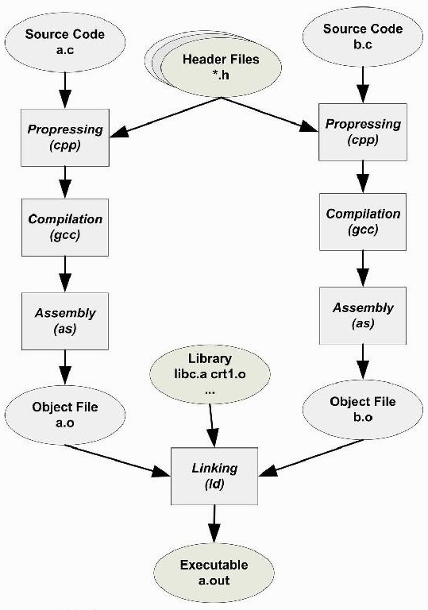
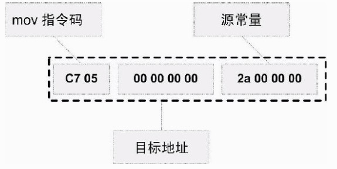
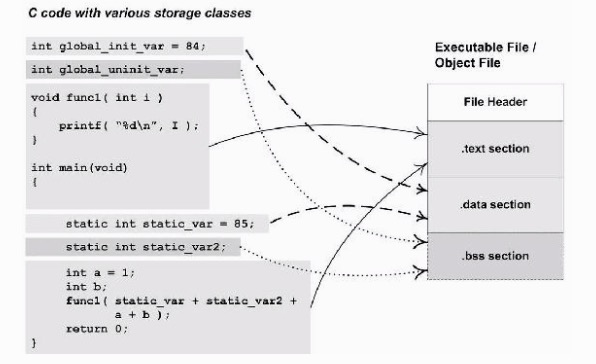
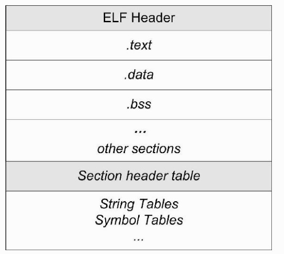
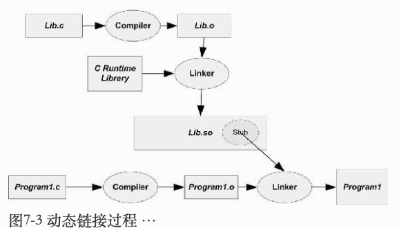
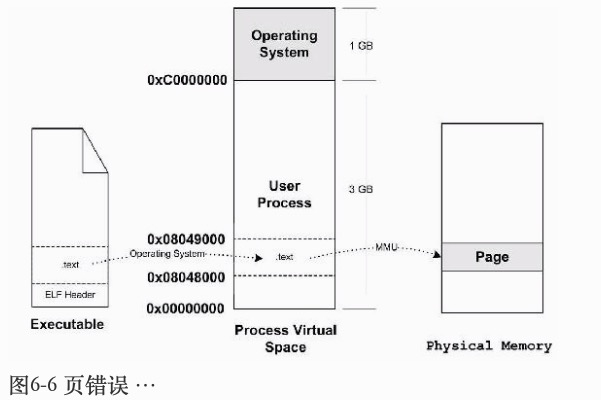
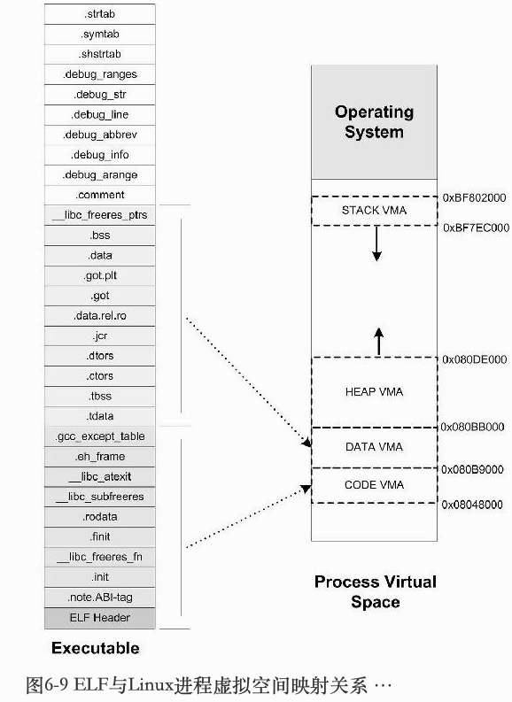

# 程序员的自我修养：链接，装载与库

## 操作系统

### 内存不够怎么办


* 分页（Paging）: 把地址空间分为固定大小的页（一般系统的虚拟内存页大小都是4KB）

```
# Linux、Mac 系统可以通过以下命令来查看虚拟页大小
getconf PAGE_SIZE  //输出4096
```

* 在页映射模式下，CPU发出的是 Virtual Address，即我们的程序看到的是虚拟地址。经过 MMU （Memory management unit）硬件转换以后就变成了物理地址 Physical Address。一般MMU都集成在CPU内部了，不会以独立的部件存在。

## 编译和链接

简单说，构建(Build)包含了编译和链接，实际上包含了四部分:

```
* 预处理（Prepressing）
* 编译（Compilation）
* 汇编（Assembly）
* 链接（Linking）
```
* 预处理：  处理宏定义和导入头文件
* 编译：词法分析、语法分析、语义分析后优化生成汇编文件，
* 汇编：将汇编代码转成机器可以执行的指令，每个汇编语句几乎都会对应一条机器指令，生成目标文件
* 链接：将多个目标文件链接起来变成可执行文件

#### 编译器的工作

* 词法分析: Source Code scan -> Tokens 
* 语法分析: Syntax Tree
* 语义分析
* 源代码优化: Source Code Optimizer -> 产生中间代码
* 目标代码生成与优化

#### 模块拼装-静态链接

链接过程主要包含了 地址和空间分配（Address and Storage Allocation）, 符号决议（Symbol Resolution）和重定位（Relocation）等步骤。

> 注： “符号决议”更倾向于静态链接，而“符号绑定”更倾向于动态链接

链接过程如下图所示：



静态链接的基本过程和作用：

```
比如我们在程序模块 main.c 中使用另外一个模块 func.c 中的函数foo(),
在 main.c 模块中每一处调用 foo 的时候都必须知道 foo 这个函数的地址，
但是由于每个模块都是单独编译的，
在编译器编译 main.c 的时候它并不知道 foo 函数的地址，
所以它暂时把这些调用 foo 的指令的目标地址搁置，
等待最后链接的时候由链接器去将这些指令的目标地址修正。
链接器在链接的时候，会根据你所引用的符号 foo，
自动去相应的 func.c 模块查找foo的地址，
然后将 main.c 模块中所有引用到foo的指令重新修正，
让它们的目标地址为真正的 foo 函数的地址。
```

再举一个具体例子：

假设我们有个全局变量叫做 var，它在目标文件A里面。我们在目标文件B里面要访问这个全局变量，比如我们在目标文件B里面有这么一条指令：

```
movl    $0x2a, var    //给这个var变量赋值0x2a, 即var = 42
```




由于在编译目标文件B的时候，编译器并不知道变量var的目标地址，所以编译器在没法确定地址的情况下，将这条mov指令的目标地址置为0，等待链接器在将目标文件A和B链接起来的时候再将其修正。

* `重定位（Relocation）`:

我们假设A和B链接后，变量var的地址确定下来为0x1000，那么链接器将会把这个指令的目标地址部分修改成0x10000。这个地址修正的过程也被叫做重定位，每个要被修正的地方叫一个重定位入口（Relocation Entry）。重定位所做的就是给程序中每个这样的绝对地址引用的位置“打补丁”，使它们指向正确的地址。

## 目标文件有什么

包含了编译后的机器指令代码、数据、链接时需要的符号表、调试信息、字符串等。
目标文件将这些信息按不同的属性，以节(Section)或段(Segment)的形式存储

* 机器指令放在代码段（Code Section）: ".code"或".text"
* 全局变量和局部静态变量数据放在数据段（Data Section）: ".data"
* 未初始化的全局变量和局部静态变量 一般放在"bss"的段里，表明要预留内存空间
* 文件头：描述文件属性，比如文件是否可执行，是静态链接还是动态链接，目标硬件、目标操作系统等消息。还包括有段表（Section Table）：描述了各个段在文件中的偏移位置和段的属性。




问题：程序的指令和数据存放为何要分开？

* 划分权限：数据区域可读性，指令段只读
* 提高CPU命中率
* 只读部分可以共享，比如说同一个程序多开时，内存中只保留一份程序的指令即可


#### ELF 文件结构描述

Linux 的可执行文件是 ELF 文件，大概结构如下：




代码段、数据段等之前都介绍了，段表（Section header table）保存了 ELF 文件中各个段的基本属性；

* `字符串表（String Tables）`:

ELF 文件中用到了很多字符串，比如段名、变量名等。因为字符串的长度往往是不定的，所以用固定的结构来表示它比较困难。一种很常见的做法是把字符串集中起来存放到一个表，然后使用字符串在表中的偏移来引用字符串。

#### 链接的接口--符号

* 在链接中，我们将函数和变量统称为符号（Symbol），函数名或变量名就是符号名（Symbol Name）
* 每一个目标文件都会有一个相应的符号表（Symbol Table），这个表里面记录了目标文件中所用到的所有符号。每个定义的符号有一个对应的值，叫做符号值（Symbol Value），对于变量和函数来说，符号值就是它们的地址。
* 在本目标文件中引用的全局符号，却没有定义在本目标文件，这一般叫做外部符号（External Symbol）。

> “为了防止不同库或者文件的符号名冲突，UNIX下的C语言就规定，C语言源代码文件中的所有全局的变量和函数经过编译以后，相对应的符号名前加上下划线“_”.

## 静态链接

* 问题:多个目标文件如何链接合并成一个可执行文件？

```
相似段合并：比如A目标文件的代码段与B目标文件的代码段合并在一起放在最终的可执行文件代码段中
```

链接过程分两步：

* 空间与地址分配: 链接器将能够获得所有输入目标文件的段长度，并且将它们合并，计算出输出文件中各个段合并后的长度与位置，并建立映射关系.

```
扫描所有的输入目标文件，获得它们的各个段的长度、属性和位置，
并且将输入目标文件中的符号表中所有的符号定义和符号引用收集起来，
统一放到一个全局符号表。
```

> 这里说的空间与地址分配指的是什么？
> 我们只关心系统加载执行文件后，分配的内存空间和地址，而不是可执行文件的实际大小

* 符号解析与重定位: 这一步是链接过程的核心，特别是重定位过程。

```
根据第一步的信息，读取输入文件中段的数据、重定位信息，
进行符号解析与重定位、调整代码中的地址等。
```

如前所述，比如 A 文件引用了B文件的变量和函数（外部符号），那么在A目标文件中，这些外部符号的地址是临时还不确定的，在链接过程中就会修正重定位。

* 那么链接器是怎么知道哪些指令符号需要被调整的呢？

在ELF文件中，有一个重定位表（Relocation Table）的结构专门用来保存这些与重定位相关的信息

```
一个重定位表往往就是ELF文件中的一个段，
比如代码段“.text”如有要被重定位的地方，那么会有一个相对应叫“.rel.text”的段保存了代码段的重定位表；
如果代码段“.data”有要被重定位的地方，就会有一个相对应叫“.rel.data”的段保存了数据段的重定位表。
```

 * 符号解析

每个目标文件都可能定义一些符号，也可能引用到定义在其他目标文件的符号。
重定位的过程中，每个重定位的入口都是对一个符号的引用，那么当链接器须要对某个符号的引用进行重定位时，它就要确定这个符号的目标地址。
这时候链接器就会去查找由所有输入目标文件的符号表组成的全局符号表，找到相应的符号后进行重定位。

#### 静态库链接

一个静态库可以简单地看成一组目标文件的集合,即很多目标文件经过压缩打包成一个文件

* 为什么静态运行库里面一个目标文件只包含一个函数？比如libc.a里面printf.o只有printf()函数、strlen.o只有strlen()函数，为什么要这样组织？

```
链接器在链接静态库的时候是以目标文件为单位的。
比如我们引用了静态库中的printf()函数，那么链接器就会把库中包含printf()函数的那个目标文件链接进来，如果很多函数都放在一个目标文件中，很可能很多没用的函数都被一起链接进了输出结果中。
由于运行库有成百上千个函数，数量非常庞大，每个函数独立地放在一个目标文件中可以尽量减少空间的浪费，那些没有被用到的目标文件（函数）就不要链接到最终的输出文件中
```


## 动态链接

* 为什么需要动态链接？

```
a）浪费内存，每个静态库都会拷贝添加到可执行文件中，然后加载到内存中
b）版本更新的问题，公用库更新后，每个依赖它的库都需要重新构建
```

* 动态链接：在程序启动运行时才去加载链接依赖库，把链接过程推迟到了运行阶段
    - 在Linux系统中，ELF动态链接文件被称为动态共享对象（DSO，Dynamic Shared Objects），简称共享对象，它们一般都是以“.so”为扩展名的一些文件；
  - 在Windows系统中，动态链接文件被称为动态链接库（Dynamical Linking Library），它们通常就是我们平时很常见的以“.dll”为扩展名的文件。

> 动态链接在运行时才链接，会导致程序有些性能损耗（据估算，动态链接与静态链接相比，性能损失大约在5%以下）

* 使用动态链接库时，链接阶段需要判断外部符号是否属于动态链接，这时候就要用到共享对象文件，示意图如下：

 


* 地址无关代码(PIC, Position-independent Code):

```
把指令中那些需要被修改的部分分离出来，跟数据部分放在一起，
这样指令部分就可以保持不变，而数据部分可以在每个进程中拥有一个副本。
```
生成地址无关代码的原则大概可以总结如下：

a）模块内部的函数调用： 无需重定位，相对地址调用
b）模块内部的数据访问： 相对寻址
c）模块外部的数据访问： ELF使用全局偏移表（GOT，Global offset table）方案解决
d）模块外部的函数调用：GOT方案， GOT保存的是函数地址

* 延迟绑定(Lazy Binding) :优化动态链接性能

```
基本的思想就是当函数第一次被用到时才进行绑定（符号查找、重定位等），
如果没有用到则不进行绑定。
所以程序开始执行时，模块间的函数调用都没有进行绑定，
而是需要用到时才由动态链接器来负责绑定
```

## 可执行文件的装载和进程

#### 进程虚拟地址空间

* 虚拟地址空间的大小由 CPU 的位数决定， 比如32位机器决定了虚拟地址空间的地址为 0 到 2^(32-1) ，4G的虚拟空间大小。（也就是32位机指针大小为4个字节，64位系统指针大小为8个字节）

#### 装载的方式

* 程序执行时所需要的指令和数据必须在内存中才能够正常运行，最简单的方法是全部装入内存中，但是内存不够时，只能装载常用的指令数据到内存中，其它的存放在磁盘里面。
* 页映射（Paging）是典型的动态装载方法，将内存和所有磁盘中的数据和指令按照“页（Page）”为单位划分成若干个页，以后所有的装载和操作的单位就是页

#### 操作系统看可执行文件的加载

进程的建立：
从操作系统的角度来看，一个进程最关键的特征是它拥有独立的虚拟地址空间，有了空间然后装载可执行文件并运行。

1. 创建一个独立的虚拟地址空间
2. 读取可执行文件头，并且建立虚拟空间与可执行文件的映射关系。
3. 将CPU的指令寄存器设置成可执行文件的入口地址，启动运行。

第一步中的创建，只是创建了虚拟页的映射结构信息，并没有分配实际内存空间。

> 可执行文件在装载时实际上是被映射的虚拟空间，所以可执行文件很多时候又被叫做映像文件（Image）

页错误（Page Fault）:
当上述步骤完成后，其实可执行文件的真正指令和数据都没有被装入到内存中。操作系统只是通过可执行文件头部的信息建立起可执行文件和进程虚存之间的映射关系而已。
当要运行可执行文件时，CPU发现执行文件的入口地址页为空页面，它会认为是一个页错误，然后由操作系统根据上述第二步的信息，找到空页面所在的VMA，计算出相应的页面在可执行文件中的偏移，然后在物理内存中分配一个物理页面，将进程中该虚拟页与分配的物理页之间建立映射关系。

简单的映射如下图所示:



#### 进程虚拟内存空间分布

* Segment 与 Section 的区别和关系：

```
ELF 文件被影射时，是以虚拟内存页的大小作为单位， 
ELF 有很多段（section），如果一段不足一页大小的话，也会分配给一页大小，浪费空间。
为了避免浪费空间，ELF将相同类型的段归为一个 Segment，减少页面内部碎片
```
> "Segment”的概念实际上是从装载的角度重新划分了ELF的各个段

####  堆和栈

* 我们知道进程在执行的时候它还需要用到栈（Stack）、堆（Heap）等空间，事实上它们在进程的虚拟空间中的表现也是以VMA的形式存在的，很多情况下，一个进程中的栈和堆分别都有一个对应的VMA

示意图如下：


#### 进程栈初始化

* 进程刚开始启动的时候，需知道一些进程运行的环境，比如系统环境变量和进程的运行参数，一般做法是操作系统在进程启动前将这些信息提取保存到进程的虚拟空间的栈中
* 进程在启动以后，程序的库部分会把堆栈里的初始化信息中的参数信息传递给main()函数，也就是我们熟知的main()函数的两个argc和argv两个参数，这两个参数分别对应进程栈的命令行参数数量和命令行参数字符串指针数组。

## 内存

* 堆与内存管理


## 运行库


参考：

* [一文领略链接与装载](https://juejin.im/post/5de7332be51d455849685b63)


